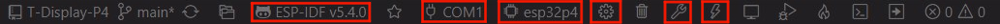
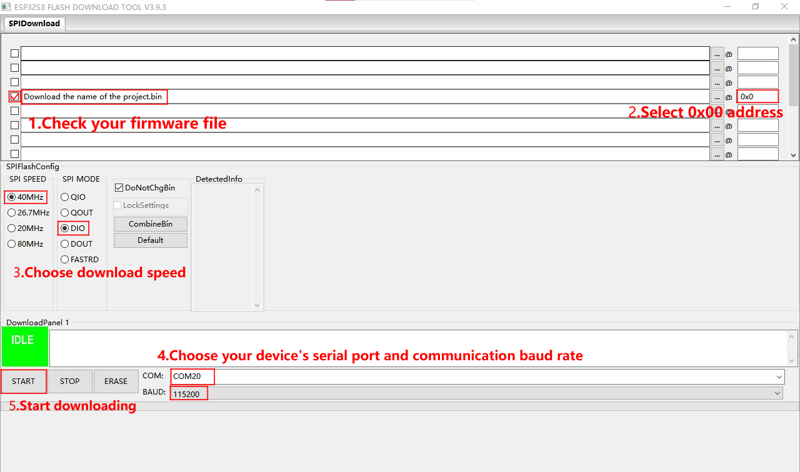

<!--
 * @Description: None
 * @Author: LILYGO_L
 * @Date: 2023-09-11 16:13:14
 * @LastEditTime: 2025-09-16 10:46:02
 * @License: GPL 3.0
-->

<h1 align = "center">T-Encoder-Pro</h1>

    

## **[English](./README.md) | 中文**

## 版本迭代:
| Version                               | Update date                       |
| :-------------------------------: | :-------------------------------: |
| T-Encoder-Pro_V1.0            | 2024-02-02                         |

## 购买链接
| Product                     | SOC           |  FLASH  |  PSRAM   | Link                   |
| :------------------------: | :-----------: |:-------: | :---------: | :------------------: |
| T-Encoder-Pro_V1.0   | ESP32S3R8 |   16M   |8M (Octal SPI)| [LILYGO Mall](https://www.lilygo.cc/products/t-encoder-plus)   [Banggood Mall](https://m.banggood.in/LILYGO-T-Encoder-Pro-ESP32-S3-Rotary-Encoder-CHSC5816-ESP32-S3FN4R2-Circuit-Board-1_2-inch-AMOLED-Touch-Display-Wireless-Module-p-2018774.html) |

## 目录
- [描述](#描述)
- [预览](#预览)
- [模块](#模块)
- [快速开始](#快速开始)
- [引脚总览](#引脚总览)
- [常见问题](#常见问题)
- [项目](#项目)
- [资料](#资料)
- [依赖库](#依赖库)

## 描述

T-Encoder-Pro是一款基于ESP32S3R8芯片的智能控制旋钮，配备AMOLED触摸屏。旋钮旋转、点击（推入），并包含一个蜂鸣器和振动电机。

## 预览

### 实物图

    

---

    

---

    

## 模块

### 1. MCU

* 芯片：ESP32-S3-R8
* PSRAM：8M (Octal SPI) 
* FLASH：16M
* 其他说明：更多资料请访问[乐鑫官方ESP32-S3数据手册](https://www.espressif.com.cn/sites/default/files/documentation/esp32-s3_datasheet_en.pdf)

### 2. 屏幕

* 尺寸：2.04英寸圆屏
* 屏幕类型：AMOLED
* 驱动芯片：SH8601A-W14-T06
* 兼容库：Arduino_GFX
* 总线通信协议：QSPI

### 3. 触摸

* 芯片：CHSC5816
* 总线通信协议：IIC

### 4. 旋转编码器

* 特性：支持左右旋转

### 5. 蜂鸣器

## 快速开始

### 例程支持

| example | `[vscode][esp-idf-v5.4.0]` | description | picture |
| ------  | ------  | ------ | ------ | 
| [iic_scan](./main/examples/iic_scan) | 
![alt text][supported] |  |  |
| [screen_touch_lvgl_9](./main/examples/screen_touch_lvgl_9) |
![alt text][supported] | |  |
| [touch](./main/examples/touch) | 
![alt text][supported] |  |  |

[supported]: https://img.shields.io/badge/-supported-green "example"

### ESP-IDF Visual Studio Code
1. 安装 [Visual Studio Code](https://code.visualstudio.com/Download) ，根据你的系统类型选择安装。

2. 打开 VisualStudioCode 软件侧边栏的“扩展”（或者使用<kbd>Ctrl</kbd>+<kbd>Shift</kbd>+<kbd>X</kbd>打开扩展），搜索“ESP-IDF”扩展并下载。

3. 在安装扩展的期间，使用git命令克隆仓库

        git clone -b espidf-v5.4 --recursive https://github.com/Xinyuan-LilyGO/T-Encoder-Pro.git

    克隆时候需要同时加上“--recursive”，如果克隆时候未加上那么之后使用的时候需要初始化一下子模块

        git submodule update --init --recursive

4. 下载安装 [ESP-IDF v5.4.1](https://dl.espressif.cn/dl/esp-idf/?idf=4.4)，记录一下安装路径，打开之前安装好的“ESP-IDF”扩展打开“配置 ESP-IDF 扩展”，选择“USE EXISTING SETUP”菜单，选择“Search ESP-IDF in system”栏，正确配置之前记录的安装路径：
   - **ESP-IDF directory (IDF_PATH):** `你的安装路径xxx\Espressif\frameworks\esp-idf-v5.4`  
   - **ESP-IDF Tools directory (IDF_TOOLS_PATH):** `你的安装路径xxx\Espressif`  
    点击右下角的“install”进行框架安装。

5. 点击 Visual Studio Code 底部菜单栏的 ESP-IDF 扩展菜单“SDK 配置编辑器”，在搜索栏里搜索“Select the example to build”字段，选择你所需要编译的项目，再在搜索栏里搜索“Select the camera type”字段，选择你的板子板载的摄像头类型，点击保存。

6. 点击 Visual Studio Code 底部菜单栏的“设置乐鑫设备目标”，选择**ESP32S3**，点击底部菜单栏的“构建项目”，等待构建完成后点击底部菜单栏的“选择要使用的端口”，之后点击底部菜单栏的“烧录项目”进行烧录程序。

    

### firmware烧录
1. 打开项目文件“tools”找到ESP32烧录工具，打开。

2. 选择正确的烧录芯片以及烧录方式点击“OK”，如图所示根据步骤1->2->3->4->5即可烧录程序，如果烧录不成功，请按住“BOOT-0”键再下载烧录。

3. 烧录文件在项目文件根目录“[firmware](./firmware/)”文件下，里面有对firmware文件版本的说明，选择合适的版本下载即可。

    
    

## 引脚总览

| 屏幕引脚       | ESP32S3引脚      |
| :------------------: | :------------------:|
| SDIO0                     | IO11                  |
| SDIO1                     | IO13                  |
| SDIO2                     | IO7                  |
| SDIO3                     | IO14                  |
| SCLK                  | IO12                  |
| RST                    | IO4                  |
| VCI EN                | IO3                  |
| CS                    | IO10                  |

| 触摸引脚          | ESP32S3引脚      |
| :------------------: | :------------------:|
| RST                  | IO8                  |
| INT                  | IO9                    |
| SDA                  | IO5                  |
| SCL                  | IO6                  |

| 旋转编码器引脚          | ESP32S3引脚      |
| :------------------: | :------------------:|
| KNOB DATA A      | IO1                  |
| KNOB DATA B      | IO2                  |
| KNOB KEY      | IO0                  |

| 蜂鸣器引脚          | ESP32S3引脚      |
| :------------------: | :------------------:|
| BUZZER DATA      | IO17                  |

## 常见问题

* Q. 看了以上教程我还是不会搭建编程环境怎么办？
* A. 如果看了以上教程还不懂如何搭建环境的可以参考[LilyGo-Document](https://github.com/Xinyuan-LilyGO/LilyGo-Document)文档说明来搭建。

 

* Q. 为什么打开Arduino IDE时他会提醒我是否要升级库文件？我应该升级还是不升级？
* A. 选择不升级库文件，不同版本的库文件可能不会相互兼容所以不建议升级库文件。

 

* Q. 为什么我的板子上“Uart”接口没有输出串口数据，是不是坏了用不了啊？
* A. 因为项目文件默认配置将USB接口作为Uart0串口输出作为调试，“Uart”接口连接的是Uart0，不经配置自然是不会输出任何数据的。 PlatformIO用户请打开项目文件“platformio.ini”，将“build_flags = xxx”下的选项“-DARDUINO_USB_CDC_ON_BOOT=true”修改成“-DARDUINO_USB_CDC_ON_BOOT=false”即可正常使用外部“Uart”接口。 Arduino用户打开菜单“工具”栏，选择USB CDC On Boot: “Disabled”即可正常使用外部“Uart”接口。

 

* Q. 为什么我的板子一直烧录失败呢？
* A. 请按住“BOOT”按键重新下载程序。下图为BOOT按键示意图

    

 

## 项目
* [SCH_T-Encoder-Pro_V1.0](./project/[SCH][T-Encoder-Pro_V1.0].pdf)
* [SCH_T-Encoder-Pro_V1.0_TFT_FPC](./project/[SCH][T-Encoder-Pro_V1.0][TFT_FPC].pdf)

## 资料
* [Espressif](https://www.espressif.com/en/support/documents/technical-documents)
* [DXQ120MYB2416A](./information/DXQ120MYB2416A.pdf)
* [DS_CHSC5816_V1.1.5](./information/DS_CHSC5816_V1.1.5.pdf)
* [CHSC5816-ApplicationDoc_US_V04](./information/CHSC5816-ApplicationDoc_US_V04.pdf)

## 依赖库
* [Arduino_GFX-1.5.0](https://github.com/moononournation/Arduino_GFX)
* [lvgl-8.3.5](https://github.com/lvgl/lvgl)
* [SensorLib-0.1.4](https://github.com/lewisxhe/SensorsLib)
